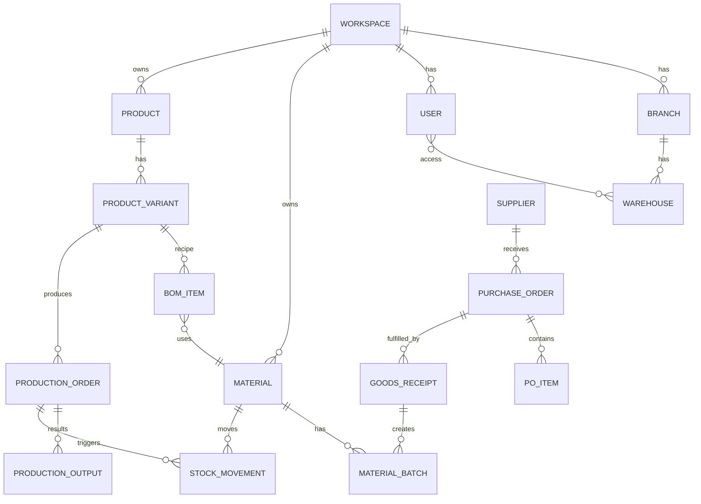

# Data Model — ManufactPro

<aside>
🗂️

**Entity Relationship Diagram & Schema** — Struktur database utama ManufactPro. Postgres via Supabase, akses via Drizzle ORM.

</aside>

## 1. Diagram Relasi Utama



## 2. Tabel Inti

### 2.1 `workspaces`

| Field | Type | Note |
| --- | --- | --- |
| id | uuid PK |  |
| name | text |  |
| costing_method | enum | `fifo` \ |
| created_at | timestamptz |  |

### 2.2 `branches` & `warehouses`

```sql
branches(id, workspace_id, name, address)
warehouses(id, branch_id, name, code, is_default)
```

### 2.3 `materials`

| Field | Type | Note |
| --- | --- | --- |
| id | uuid PK |  |
| workspace_id | uuid FK |  |
| sku | text UNIQUE |  |
| name | text |  |
| unit | text | meter / pcs / gram / liter |
| category | text |  |
| min_stock | numeric |  |
| barcode | text |  |
| image_url | text |  |
| is_active | bool |  |

### 2.4 `material_batches` (untuk FIFO/HPP)

```sql
material_batches(
  id, material_id, warehouse_id,
  batch_no, qty_received, qty_remaining,
  unit_cost, supplier_id, received_at, expiry_at
)
```

### 2.5 `products` & `product_variants`

```sql
products(id, workspace_id, name, category, description, image_url)
product_variants(
  id, product_id, sku, barcode,
  attributes jsonb,  -- { size: "M", color: "Merah" }
  sell_price, is_active
)
```

### 2.6 `bom_items`

```sql
bom_items(
  id, product_variant_id,
  material_id, qty, unit,
  is_optional, note
)
-- UNIQUE(product_variant_id, material_id)
```

### 2.7 `stock_movements` (immutable log)

```sql
stock_movements(
  id, workspace_id, warehouse_id,
  item_type enum,         -- 'material' | 'product_variant'
  item_id uuid,
  qty numeric,             -- positif = in, negatif = out
  movement_type enum,      -- IN_PURCHASE, OUT_PRODUCTION, etc.
  reference_type text,     -- 'production_order' | 'po' | 'transfer'
  reference_id uuid,
  unit_cost numeric,       -- untuk HPP snapshot
  reason text,             -- untuk waste/reject/adjustment
  created_by uuid,
  created_at timestamptz
)
```

### 2.8 `production_orders` & `production_outputs`

```sql
production_orders(
  id, workspace_id, warehouse_id,
  product_variant_id, qty_planned,
  status enum, planned_at, started_at, completed_at,
  total_cost numeric, created_by
)

production_outputs(
  id, production_order_id,
  qty_good, qty_reject, qty_waste,
  reject_reason, waste_reason,
  recorded_at
)
```

### 2.9 `suppliers`, `purchase_orders`, `po_items`, `goods_receipts`

```sql
suppliers(id, workspace_id, name, contact, email, phone, payment_term)

purchase_orders(
  id, workspace_id, supplier_id, warehouse_id,
  po_number, status enum, total_amount,
  ordered_at, expected_at
)

po_items(
  id, po_id, material_id, qty_ordered, unit_price
)

goods_receipts(
  id, po_id, received_at, received_by, note
)
```

### 2.10 `sync_queue` (client-side, IndexedDB)

```tsx
syncQueue: {
  id: string
  operation: 'create' | 'update' | 'delete'
  entity: string         // 'material' | 'stock_movement' | ...
  payload: object
  client_timestamp: number
  status: 'pending' | 'syncing' | 'synced' | 'failed'
  retries: number
  error?: string
}
```

## 3. Index Penting

```sql
CREATE INDEX idx_stock_mov_item ON stock_movements(item_id, warehouse_id, created_at DESC);
CREATE INDEX idx_batches_fifo ON material_batches(material_id, warehouse_id, received_at);
CREATE INDEX idx_variant_barcode ON product_variants(barcode);
CREATE INDEX idx_material_barcode ON materials(barcode);
```

## 4. View / Materialized View

```sql
-- Stok real-time per gudang per item
CREATE VIEW v_current_stock AS
SELECT
  workspace_id, warehouse_id, item_type, item_id,
  SUM(qty) AS qty_on_hand
FROM stock_movements
GROUP BY workspace_id, warehouse_id, item_type, item_id;
```

## 5. RLS Policy (Supabase)

Setiap tabel difilter berdasarkan `workspace_id` user yang sedang login + role-based write access:

```sql
CREATE POLICY "workspace_isolation" ON materials
FOR ALL USING (workspace_id = auth.jwt() ->> 'workspace_id');
```