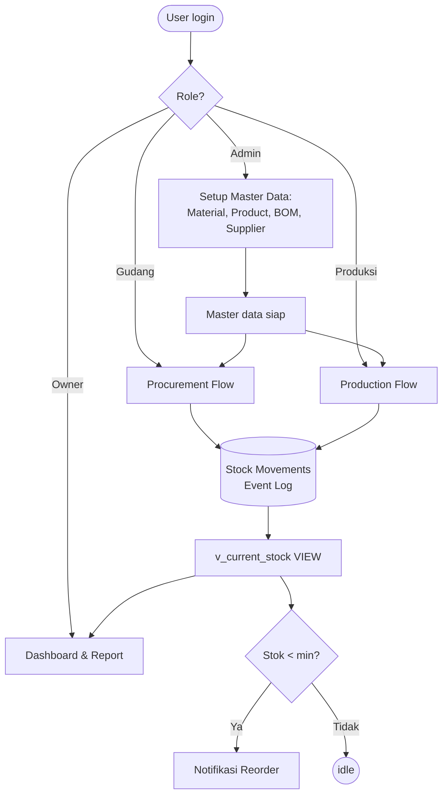
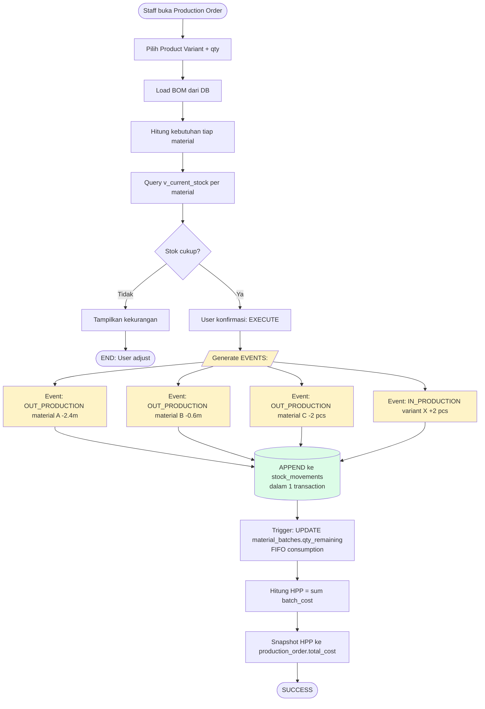
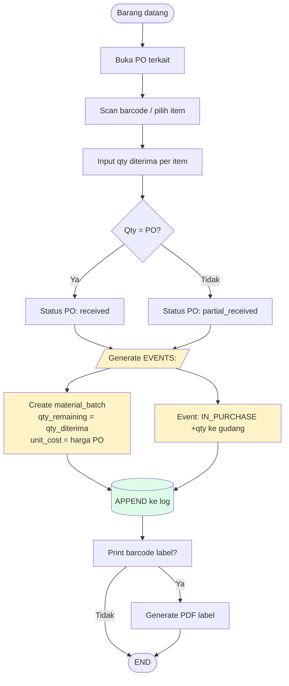
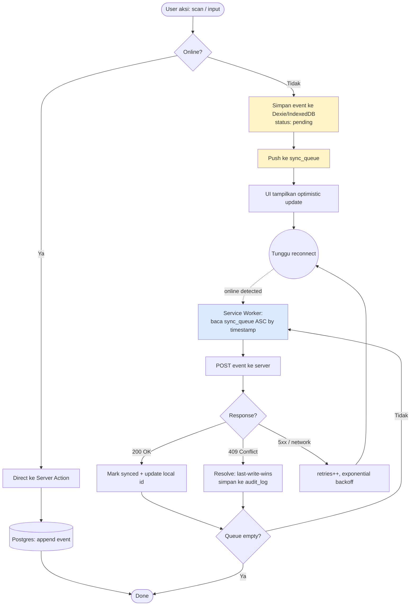
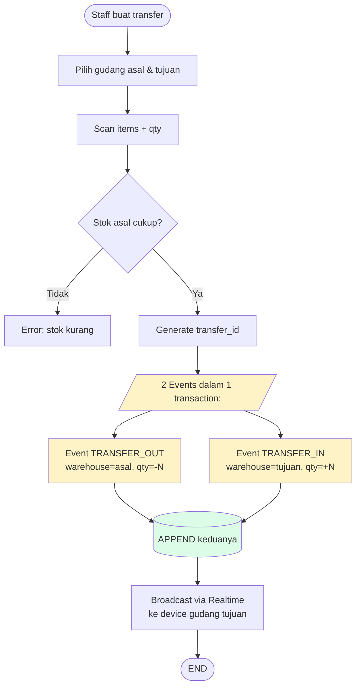
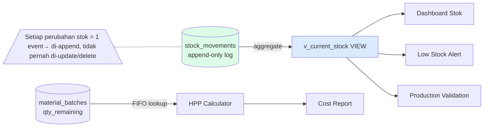

# Flowchart — ManufactPro

<aside>
🔀

**Flowchart** — Alur proses bisnis utama ManufactPro, termasuk pola **Event Sourcing** untuk pengamanan data stok.

</aside>

## 1. Big Picture: Alur Aplikasi

## 2. Flowchart: Production Order (Mengilustrasikan Event Sourcing)

<aside>
💡

**Inti Event Sourcing di sini:** Sistem tidak menulis `material.stock = 100`. Sistem **append** event `{material_id, qty: -2.4, type: OUT_PRODUCTION, ref: production_order_id}`. Stok saat ini = hasil SUM dari semua event. Ini yang mengamankan data.

</aside>

## 3. Flowchart: Goods Receipt (Penerimaan Barang)

## 4. Flowchart: Offline-First Operation

<aside>
🔒

**Kenapa Event Sourcing aman untuk offline:** Yang dikirim ke server adalah **event** (aksi), bukan **state** (hasil akhir). Walaupun 5 device offline melakukan operasi, semua event masuk ke log dalam urutan timestamp. Tidak ada "overwrite" stok — hanya append.

</aside>

## 5. Flowchart: Transfer Antar Gudang

## 6. Flowchart: Stok Real-time (Read Model)

## 7. Ringkasan Pola Event Sourcing yang Dipakai

| Aspek | Implementasi |
| --- | --- |
| **Event Store** | Tabel `stock_movements` (immutable, append-only) |
| **Event Schema** | `{id, item_id, warehouse_id, qty, movement_type, ref, unit_cost, reason, ts, user}` |
| **Aggregate** | `v_current_stock` VIEW (SUM per item per warehouse) |
| **Snapshot** | `production_orders.total_cost` (HPP saat completed) |
| **Compensation** | Movement reverse (mis. `ADJUSTMENT` dengan qty berlawanan) — tidak pernah DELETE event |
| **Replay** | Bisa hitung ulang stok di tanggal X: `SUM(qty) WHERE created_at <= X` |
| **Offline event log** | `sync_queue` di IndexedDB — event yang menunggu sync |
| **Concurrency** | Optimistic + transaction Postgres + `last-write-wins` untuk offline conflict |

## 8. Yang TIDAK Pakai Event Sourcing

- Master data (Material, Product, BOM, Supplier) → CRUD biasa dengan `updated_at`.
- User profile, settings, dll → CRUD biasa.

Alasan: event sourcing untuk data yang **tidak sering berubah** dan **tidak butuh audit ketat** adalah overkill. Disiplin diterapkan hanya di tempat yang penting: **stok & uang**.