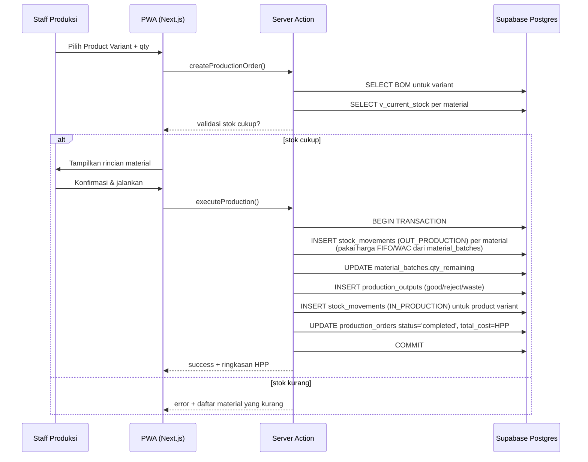
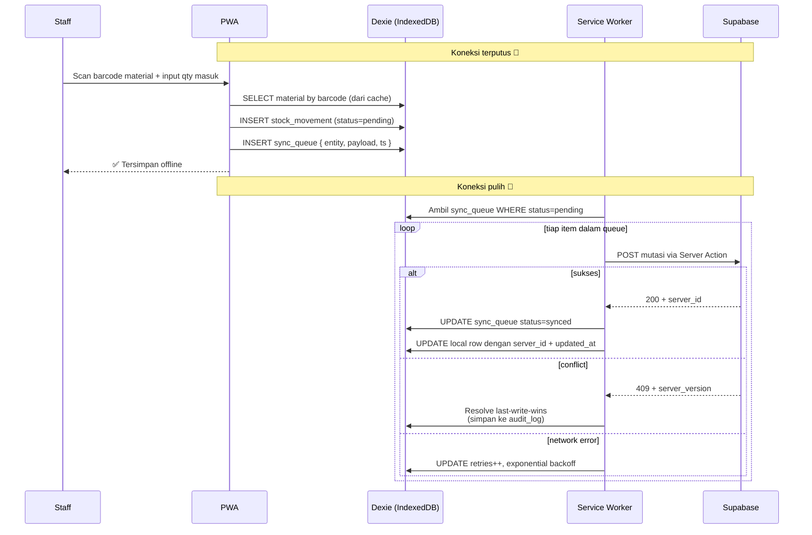
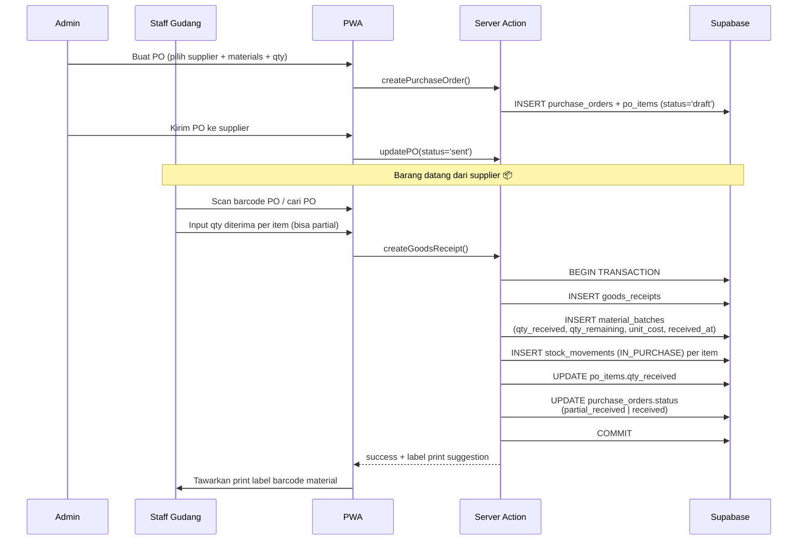
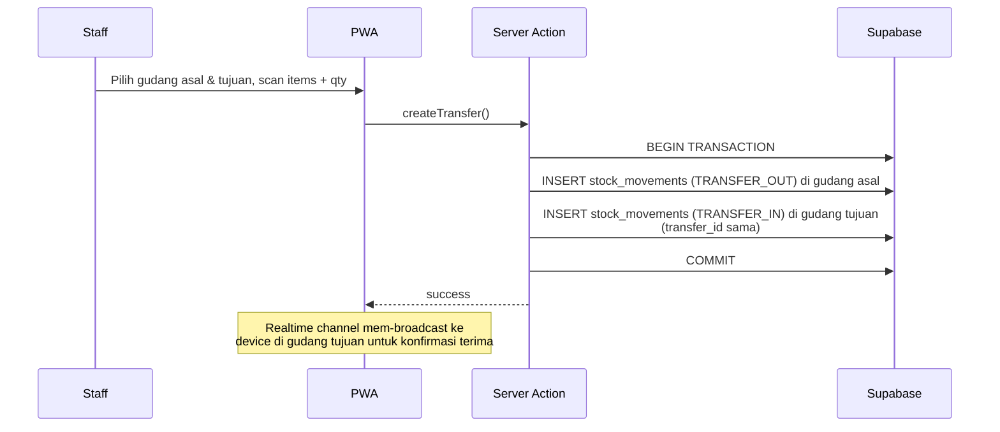
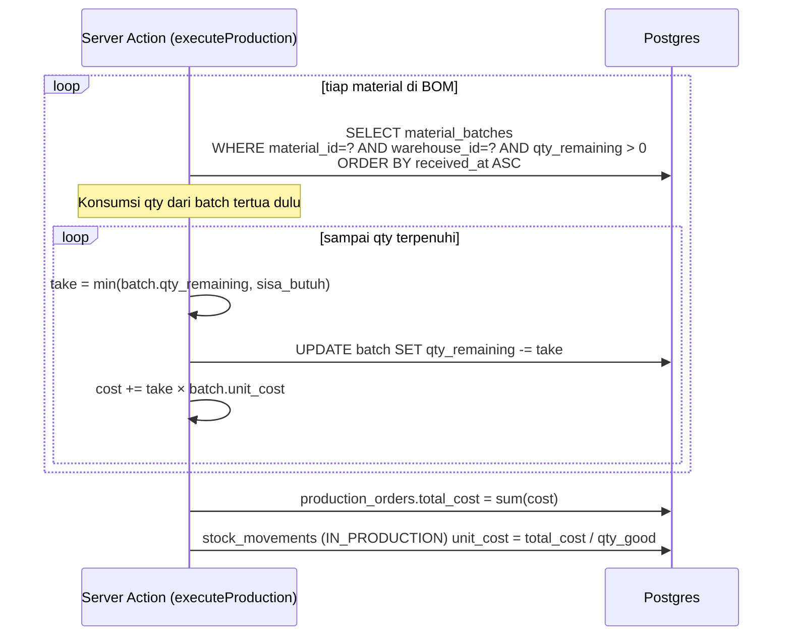

# Sequence Diagram — ManufactPro

<aside>
🔁

**Sequence Diagrams** untuk skenario kritikal: Production Order, Offline Sync, Purchase Order & Goods Receipt.

</aside>

## 1. Production Order (Online)

## 2. Offline-First: Operasi Saat Tidak Ada Koneksi

## 3. Purchase Order → Goods Receipt → Material Batch

## 4. Transfer Antar Gudang

## 5. Perhitungan HPP (FIFO)

